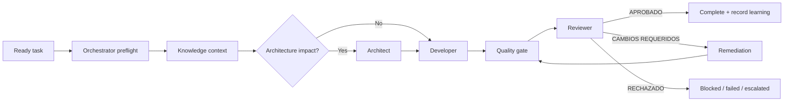

# Shogun DevOS

> **One commander. Seven disciplined specialists. Every decision leaves a trace.**

**Shogun** is the military ruler of feudal Japan: a single command authority
coordinating a disciplined hierarchy of specialists. This template applies that
model to autonomous engineering: one orchestrator commands the delivery cycle,
each agent owns a narrow role, and no decision advances without a record.

Shogun DevOS is a reusable OpenCode foundation for new or existing software
projects. It provides a deterministic seven-agent delivery loop, GitHub
Copilot model assignments, protected pipeline state, quality gates, and an
optional TencentDB Agent Memory deployment.

## What You Get

- A single **orchestrator** that owns every delegation and state transition.
- Six constrained subagents with distinct responsibilities.
- GitHub Copilot as the native provider, with verified model IDs.
- Persistent pipeline state, append-only events, contract validation, and a
  Windows-safe execution lock.
- Explicit test, lint, and build gates. A missing gate is never silently
  considered successful.
- Local project memory (`memory/`, `docs/learning-log.md`) out of the box.
- Optional TencentDB Agent Memory services for a team memory hub, Wiki,
  CodeGraph, and long-term conversation assets.

## The Seven Roles

| Role | OpenCode agent | Model | Responsibility |
|---|---|---|---|
| Director | `orchestrator` | `github-copilot/gpt-5.6-terra` | Selects work, controls transitions, dispatches one agent at a time |
| Architect | `architect` | `github-copilot/gpt-5.6-terra` | Validates design, ADRs, architecture impact |
| Planner | `planner` | `github-copilot/gpt-5.6-terra` | Breaks requirements into ready, verifiable work |
| Builder | `developer` | `github-copilot/gpt-5.6-terra` | Implements the smallest correct change and tests |
| Reviewer | `reviewer` | `github-copilot/gpt-5.6-terra` | Gates quality, security, performance, and acceptance criteria |
| Refiner | `refactor` | `github-copilot/gpt-5.6-terra` | Performs safe, behavior-preserving refactors |
| Archivist | `knowledge` | `github-copilot/gpt-5.6-luna` | Maintains memory, learning log, and historical context |

The Copilot catalog exposes `gpt-5.6-terra` and `gpt-5.6-luna`; it does not
expose separate `-high` or `-medium` model IDs. Terra is used for engineering
judgment and Luna for high-volume memory retrieval and organization.

## Delivery Flow



The pipeline is sequential. Only `orchestrator` can call subagents. Every
subagent has `task: deny`, and `subagent_depth: 1` prevents nested delegation.

## Use This As a Template

### Prerequisites

- [OpenCode](https://opencode.ai) with GitHub Copilot access.
- PowerShell 7 or later on Windows. The enforcement scripts use only native
  PowerShell functionality.
- Git.
- Docker Desktop only if you enable the optional TencentDB memory hub.

### Create a Project

Use GitHub's **Use this template** action, clone this repository, or copy its
configuration into an existing project. For an existing project, merge these
paths rather than overwriting project files blindly:

```text
opencode.json
.opencode/
.gitignore
docs/adr/
deploy/memory/                 # optional
```

From the new project root, connect OpenCode to Copilot:

```text
/connect
```

Select **GitHub Copilot**, complete the device-login flow, then verify the
available models:

```text
/models
```

Restart OpenCode after copying configuration files. OpenCode loads configuration,
agents, commands, and skills only at startup.

### Bootstrap Project Documents

In OpenCode, run:

```text
/devos-bootstrap
```

It creates or adapts the project working set without overwriting existing files:

```text
docs/requirements.md
docs/backlog.md
docs/stack.md
docs/learning-log.md
docs/technical-debt-system.md
docs/evolution-system.md
docs/refactor-system.md
memory/INDEX.md
```

Fill in `docs/stack.md` and create `ready` tasks in `docs/backlog.md` before
running an autonomous delivery cycle.

## Run A Cycle

Use the default `orchestrator` agent or invoke:

```text
/devos Implement BACKLOG-001: add account lockout after five failed logins.
```

The orchestrator performs this sequence:

1. Validates Shogun DevOS configuration.
2. Acquires an exclusive `.lciss/lock/` directory lock.
3. Creates `.lciss/state/current.json` for the run.
4. Dispatches exactly one subagent at a time.
5. Validates the output contract after each step.
6. Runs quality gates before review.
7. Allows at most two remediation passes.
8. Escalates after three consecutive failures for the same task.
9. Records artifacts and append-only events under `.lciss/`.

Runtime data is intentionally ignored by Git:

```text
.lciss/state/
.lciss/lock/
.lciss/outputs/
.lciss/logs/
```

Do not manually edit `current.json`, outputs, or lock ownership while a run is
active. If a process crashes and the lock exceeds its configured TTL, recovery
requires the explicit `-RecoverStaleLock` switch after human verification.

## Quality Gates

Configure project commands in `.opencode/pipeline/pipeline.json`.

For a typical Node project:

```json
{
  "qualityGate": {
    "test": { "required": true, "command": "npm test" },
    "lint": { "required": true, "command": "npm run lint" },
    "build": { "required": true, "command": "npm run build" }
  }
}
```

For a .NET project:

```json
{
  "qualityGate": {
    "test": { "required": true, "command": "dotnet test" },
    "lint": { "required": false, "command": "", "notApplicableReason": "No separate linter is configured." },
    "build": { "required": true, "command": "dotnet build --no-restore" }
  }
}
```

Each gate needs either:

- `required: true` and a non-empty `command`; or
- `required: false` and an explicit `notApplicableReason`.

Run them manually when needed:

```powershell
pwsh -NoProfile -File .opencode/pipeline/scripts/Invoke-QualityGate.ps1 -Root .
```

## Pipeline Contracts

Each subagent returns one JSON object in a fenced `json` block. The full
protocol is in `.opencode/pipeline/AGENT_OUTPUT_PROTOCOL.md`.

Required fields include:

```json
{
  "contractVersion": "1.0",
  "runId": "<active run id>",
  "taskId": "BACKLOG-001",
  "agent": "developer",
  "status": "succeeded",
  "summary": "Implemented lockout policy and tests.",
  "artifacts": ["src/auth/lockout.ts", "tests/lockout.test.ts"],
  "qualityEvidence": {
    "tests": "passed",
    "lint": "passed",
    "build": "passed"
  },
  "next": "quality-gate",
  "issues": [],
  "timestampUtc": "2026-08-19T00:00:00Z"
}
```

The reviewer additionally returns one of:

```text
APROBADO
CAMBIOS REQUERIDOS
RECHAZADO
```

The state controller rejects malformed contracts, unexpected agents, incorrect
run/task IDs, and invalid transitions.

## Local Memory: Always Available

Shogun DevOS never requires external memory services to operate. The local,
versioned knowledge layer is:

| Location | Purpose |
|---|---|
| `memory/` | Patterns, decisions, bugs, architecture notes, refactor findings |
| `memory/INDEX.md` | Discovery index for local knowledge |
| `docs/learning-log.md` | Append-only record of cycle decisions and outcomes |
| `.lciss/state/events.ndjson` | Runtime event trail for active and completed cycles |

`knowledge` maintains `memory/` and the learning log. Other agents return
findings to `orchestrator`, which routes them to `knowledge`; they do not write
memory directly.

## Optional Team Memory: TencentDB Agent Memory

`deploy/memory/` deploys the official TencentDB Agent Memory images locally:

| Service | Port | Purpose |
|---|---:|---|
| memory-core | 8420 | L0-L3 memory API, extraction, skills metadata |
| memory-hub | 8125 | Team, agent, task, and asset management panel |
| knowledge | 8424 | Wiki and CodeGraph API |
| proxy | 8096 | Optional LLM proxy for memory-aware clients |

### Start The Hub

```powershell
Copy-Item deploy/memory/.env.example deploy/memory/.env
# Edit deploy/memory/.env and replace every REPLACE_ME value.
pwsh -NoProfile -File deploy/memory/start.ps1
```

The script generates `deploy/memory/config/proxy.yaml`, starts Docker Compose,
creates an admin user key in `deploy/memory/.admin-key`, and prints service
URLs. Those files are ignored by Git.

Open `http://localhost:8125`, then create:

1. A **Team** for the project.
2. An **Agent** for each memory persona you want to maintain.
3. A **Task** when task-level memory isolation is needed.

### Environment Reference

Copy `.env.example` to `.env`; never commit `.env` or `.admin-key`.

| Variable group | Used by | Meaning |
|---|---|---|
| `MEMORY_LLM_BASE_URL`, `MEMORY_LLM_API_KEY`, `MEMORY_LLM_MODEL` | memory-core + hub | LLM used for summarization, extraction, Wiki, and skills |
| `PROXY_UPSTREAM_URL`, `PROXY_UPSTREAM_API_KEY`, `PROXY_UPSTREAM_MODEL` | proxy | LLM endpoint and model forwarded by the optional proxy |
| `MEMORY_*_PORT` | Docker Compose | Local exposed ports |
| `MEMORY_CORE_GATEWAY_API_KEY` | internal services | Leave empty only for local, loopback-only development |
| `TDAI_USER_KEY` | optional proxy client | User key from the panel/API key screen |
| `TDAI_TEAM_ID`, `TDAI_AGENT_ID`, `TDAI_TASK_ID` | optional proxy client | Identity binding for team, agent, and task |
| `TDAI_CONVERSATION_ID` | optional proxy client | Session identifier; rotate it between independent conversations |

### Important Copilot Boundary

This template runs agents directly through the native `github-copilot`
provider. TencentDB is therefore a companion memory hub by default; it does
not intercept Copilot traffic automatically.

Do not replace the Copilot provider with the proxy unless all of these are
true:

1. The proxy upstream serves the exact requested model IDs (`gpt-5.6-terra`
   and `gpt-5.6-luna`).
2. Your client can send `x-team-id`, `x-agent-id`, `x-task-id`, and a distinct
   `x-conversation-id` on every request.
3. You have tested the proxy independently before making it the default model
   transport.

Keeping Copilot native avoids a local proxy outage preventing the agent system
from operating.

## Security Model

The configuration denies destructive and remote Bash operations by default,
including `git push`, `git reset --hard`, `git clean`, package installation,
file deletion, `Invoke-WebRequest`, and `Invoke-Expression`.

The PowerShell wrappers are allowed because they enforce state, contracts, and
quality gates. Permission rules are an authorization layer, not a security
sandbox: review the scripts before widening Bash permissions for a project.

## Troubleshooting

### An agent says its model cannot be found

1. Restart OpenCode after configuration changes.
2. Run `/connect` and select GitHub Copilot.
3. Run `/models` and confirm your Copilot plan exposes `gpt-5.6-terra` and
   `gpt-5.6-luna`.
4. If organization policy restricts a model, update the affected agent
   frontmatter to another model shown in the live picker.

### The pipeline refuses to start

Run:

```powershell
pwsh -NoProfile -File .opencode/pipeline/scripts/Test-LcissConfig.ps1 -Root .
```

Fix every reported error before restarting a cycle.

### A previous run left a lock

First inspect the owner:

```powershell
Get-Content .lciss/lock/owner.json
```

Only after confirming the owner process has stopped and the TTL has elapsed,
start a new cycle with `-RecoverStaleLock`.

### PowerShell shows a WinGet module error at startup

The included profile guard only imports `Microsoft.WinGet.CommandNotFound` when
`winget.exe` exists. Reload it with:

```powershell
. $PROFILE
```

## Repository Map

```text
.
├── opencode.json                         # provider, agent depth, permissions
├── .opencode/
│   ├── agent/                             # the seven agent definitions
│   ├── command/                           # /devos and /devos-bootstrap
│   ├── pipeline/                          # state machine, contracts, scripts
│   └── skill/lciss-devos/                 # architecture reference
├── deploy/memory/                         # optional TencentDB deployment
├── docs/adr/                              # architectural decisions
├── memory/                                # created per target project
└── .lciss/                                # ignored runtime state
```

## Operating Principles

1. One active agent at a time.
2. Every change is reviewed before completion.
3. Tests stay green, or a gate must state why it does not apply.
4. Knowledge is appended, never silently erased.
5. Three consecutive failures require human intervention.
6. Configuration changes require an OpenCode restart.

---

**Shogun DevOS** is not a collection of prompts. It is a command system for
software delivery: deliberate, disciplined, and accountable at every step.
